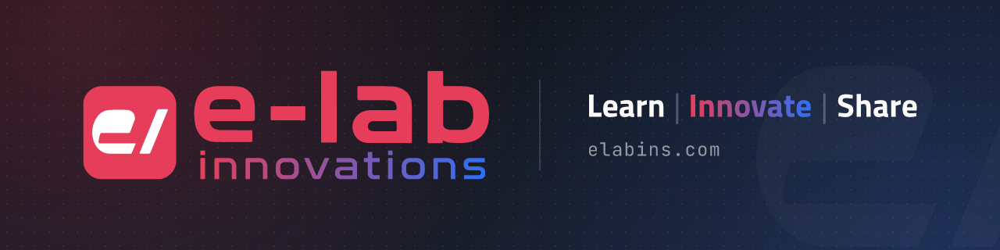
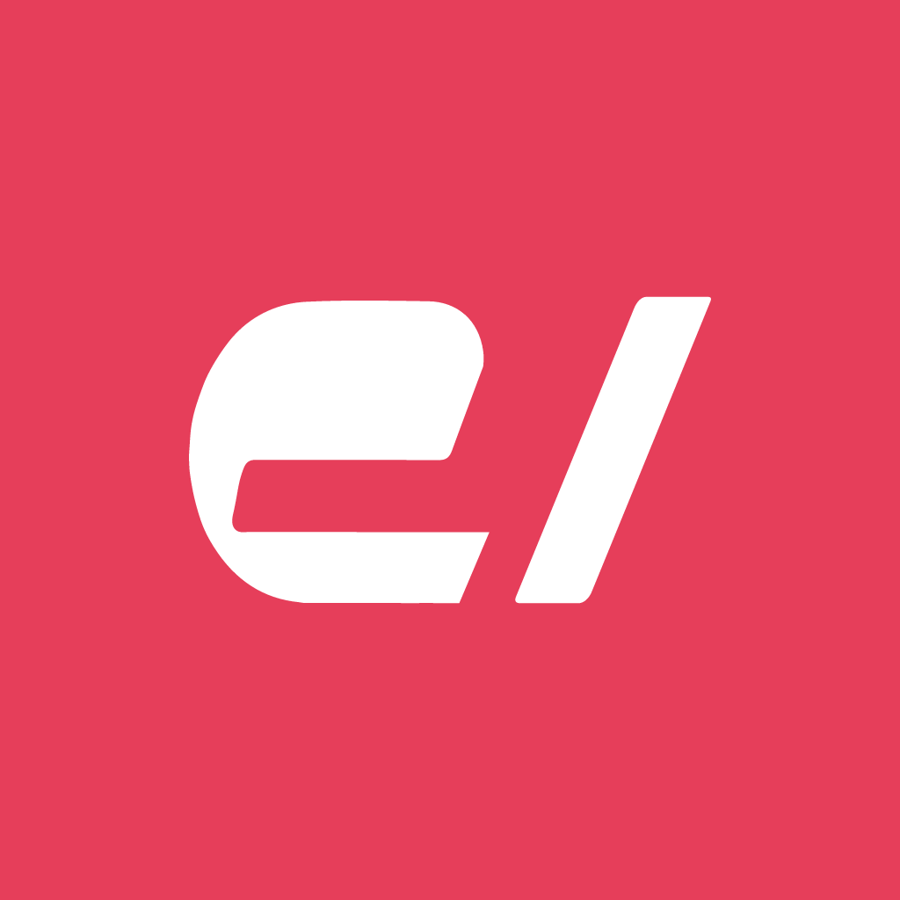
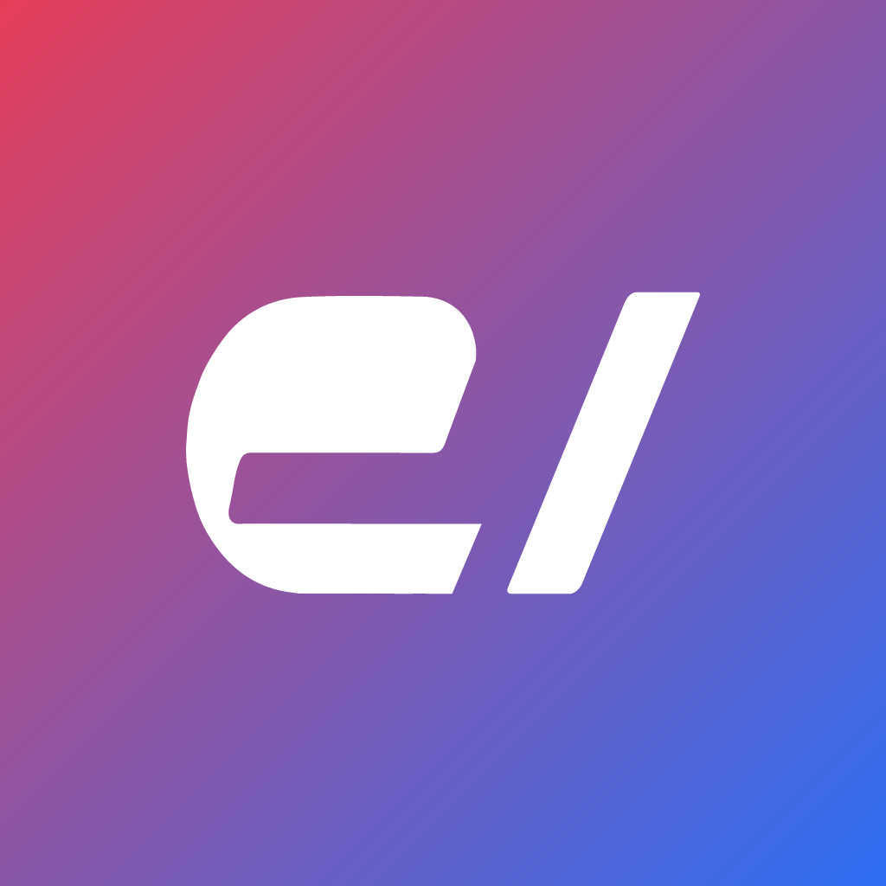
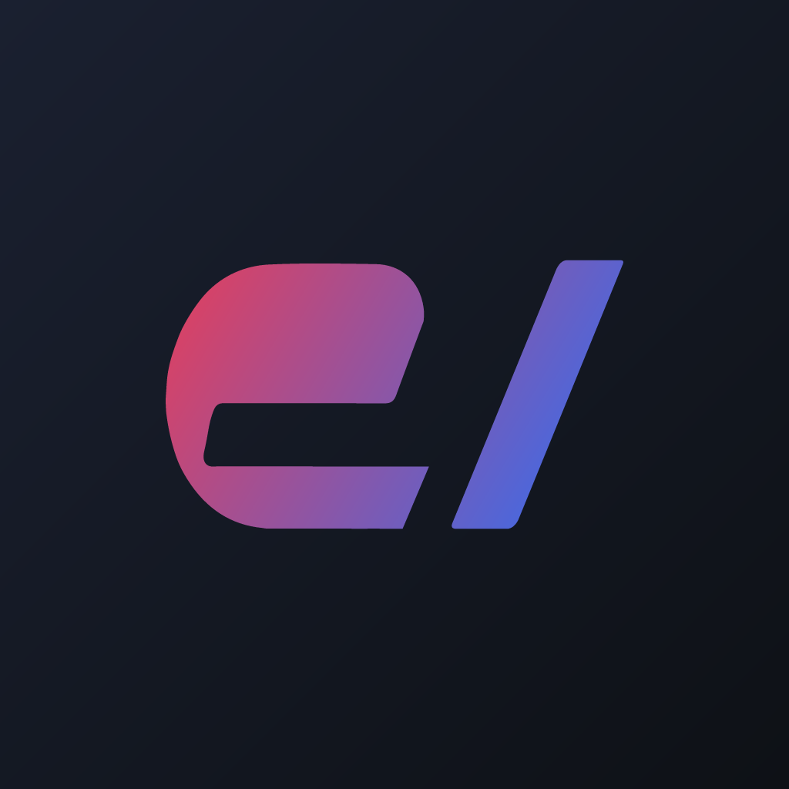
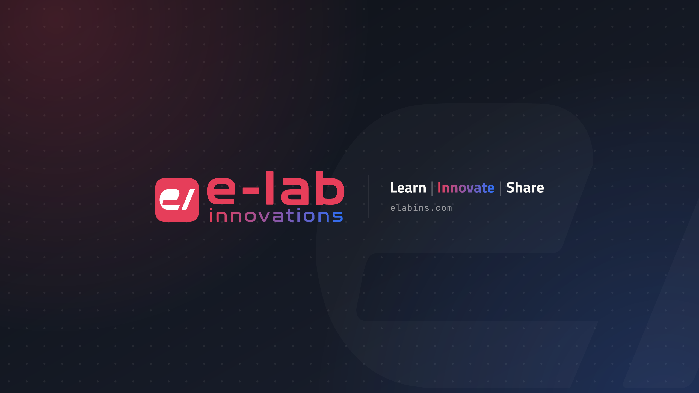

# e-lab innovations — brand assets

Logos, circle-safe avatars and platform banners, generated from SVG sources.



## Logos

| Square | Wide |
|---|---|
|  |  |

Sources: [src/logo.svg](./src/logo.svg), [src/logo-wide.svg](./src/logo-wide.svg) (same as elabins.com `public/`).
PNG exports: [dist/logo/](./dist/logo/)

## Avatar

Platforms crop profile pictures to a circle, which clips the rounded-square logo.
The avatar fills the whole square and keeps the `e/` mark inside the circle.

| red (active) | gradient | dark |
|---|---|---|
|  |  |  |

Switch variant with `avatarVariant` in [brand.config.mjs](./brand.config.mjs) and rebuild.

| Platform | File | Size |
|---|---|---|
| GitHub | [github.png](./dist/avatar/github.png) | 500 |
| Gravatar | [gravatar.png](./dist/avatar/gravatar.png) | 2048 |
| X / Twitter | [x-twitter.png](./dist/avatar/x-twitter.png) | 400 |
| LinkedIn | [linkedin.png](./dist/avatar/linkedin.png) | 400 |
| YouTube | [youtube.png](./dist/avatar/youtube.png) | 800 |
| Instagram | [instagram.png](./dist/avatar/instagram.png) | 1080 |
| Facebook | [facebook.png](./dist/avatar/facebook.png) | 720 |
| Discord | [discord.png](./dist/avatar/discord.png) | 1024 |
| Telegram | [telegram.png](./dist/avatar/telegram.png) | 640 |
| WhatsApp | [whatsapp.png](./dist/avatar/whatsapp.png) | 640 |
| Bluesky | [bluesky.png](./dist/avatar/bluesky.png) | 1000 |
| Generic | [avatar-*.png](./dist/avatar/) | 128–2048 |

Vector: [dist/avatar/avatar.svg](./dist/avatar/avatar.svg)

## Banners

| Platform | File | Size | Where to upload |
|---|---|---|---|
| YouTube | [youtube.png](./dist/banner/youtube.png) | 2560×1440 | Channel → Customisation → Branding |
| X / Twitter | [x-twitter.png](./dist/banner/x-twitter.png) | 1500×500 | Profile header |
| Bluesky | [bluesky.png](./dist/banner/bluesky.png) | 3000×1000 | Profile banner |
| LinkedIn | [linkedin.png](./dist/banner/linkedin.png) | 1584×396 | Profile background |
| Facebook | [facebook.png](./dist/banner/facebook.png) | 1640×624 | Cover photo |
| Discord | [discord-profile.png](./dist/banner/discord-profile.png) | 1360×480 | Profile banner (Nitro) |
| Discord | [discord-server.png](./dist/banner/discord-server.png) | 960×540 | Server banner |
| GitHub | [github-social.png](./dist/banner/github-social.png) | 1280×640 | Repo → Settings → Social preview |
| GitHub | [github-readme.png](./dist/banner/github-readme.png) | 1280×320 | Header in profile README |
| Website | [og-default.png](./dist/banner/og-default.png) | 1200×630 | Default Open Graph image |
| Gravatar | [gravatar-header.png](./dist/banner/gravatar-header.png) | 2400×800 | Profile → Design → Header image (fill: cover, centre) |
| Gravatar | [gravatar-background.png](./dist/banner/gravatar-background.png) | 1920×1080 | Profile → Design → Background image (texture only) |

Vectors (text outlined): [dist/banner/svg/](./dist/banner/svg/)



## Build

```sh
npm install
npm run build            # everything → dist/
npm run build -- youtube # only ids containing "youtube"
npm run preview          # .preview/ — safe-area guides + circle-cropped avatars
```

- [brand.config.mjs](./brand.config.mjs) — colours, tagline, URL, fonts, active avatar variant
- [platforms.config.mjs](./platforms.config.mjs) — every output: sizes and banner safe areas
- [scripts/lib/templates.mjs](./scripts/lib/templates.mjs) — avatar and banner designs
- Rendering: [@resvg/resvg-js](https://github.com/thx/resvg-js), bundled fonts only ([fonts/](./fonts/), SIL OFL) so output is identical on every machine

Add a platform: append an entry to `platforms.config.mjs`, run `npm run preview` to check the safe area, then `npm run build`.

## Archive

Earlier sets: [archive/2020/](./archive/2020/), [archive/2021/](./archive/2021/)
